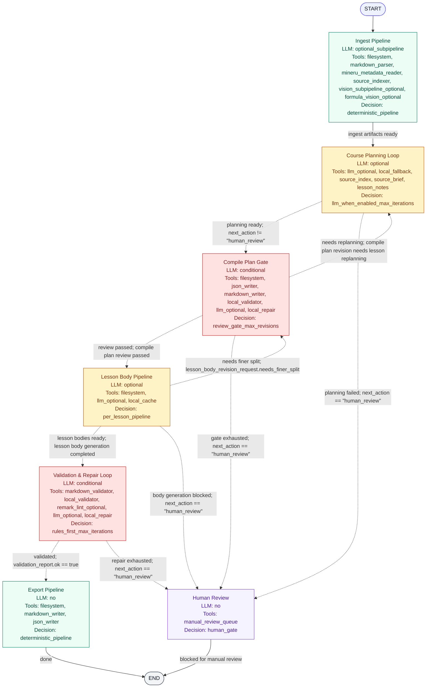

# Agent Graph State Diagram

Generated from `agent_graph.compiler` metadata. Regenerate this file after changing the agent graph:

```bash
.venv/bin/python scripts/render_agent_graph.py --render-svg
```



## Node Semantics

| Node | Type | LLM | Tools | Decision | State Outputs |
| --- | --- | --- | --- | --- | --- |
| `ingest_pipeline` | logic_pipeline | optional_subpipeline | filesystem, markdown_parser, mineru_metadata_reader, source_indexer, vision_subpipeline_optional, formula_vision_optional | deterministic_pipeline | `parsed_chunks`, `image_understanding`, `source_index` |
| `course_planning_loop` | bounded_agent_loop | optional | llm_optional, local_fallback, source_index, source_brief, lesson_notes | llm_when_enabled_max_iterations | `source_brief`, `course_plan`, `lesson_notes`, `units`, `logic_graph`, `gap_report`, `outline`, `lessons` |
| `compile_plan_gate` | gate_loop | conditional | filesystem, json_writer, markdown_writer, local_validator, llm_optional, local_repair | review_gate_max_revisions | `compile_plan`, `compile_plan_review`, `compile_plan_revisions`, `next_action` |
| `lesson_body_pipeline` | llm_pipeline | optional | filesystem, llm_optional, local_cache | per_lesson_pipeline | `lesson_bodies`, `lesson_body_inputs`, `lesson_body_revision_request`, `lessons`, `next_action` |
| `validation_repair_loop` | gate_loop | conditional | markdown_validator, local_validator, remark_lint_optional, llm_optional, local_repair | rules_first_max_iterations | `markdown_syntax_report`, `markdown_repair_audit`, `validation_report`, `compile_patches`, `lessons`, `next_action` |
| `export_pipeline` | logic_pipeline | no | filesystem, markdown_writer, json_writer | deterministic_pipeline | `course_meta`, `version_record`, `lessons` |
| `human_review` | human_gate | no | manual_review_queue | human_gate | `next_action` |

## Transitions

| From | To | Type | Decided By | Condition / Label |
| --- | --- | --- | --- | --- |
| `ingest_pipeline` | `course_planning_loop` | logic | logic_pipeline | `ingest artifacts ready` |
| `export_pipeline` | END | logic | logic_pipeline | `done` |
| `human_review` | END | logic | logic_pipeline | `blocked for manual review` |
| `course_planning_loop` | `compile_plan_gate` | conditional | bounded_planning_loop | `planning ready; next_action != "human_review"` |
| `course_planning_loop` | `human_review` | conditional | bounded_planning_loop | `planning failed; next_action == "human_review"` |
| `compile_plan_gate` | `lesson_body_pipeline` | conditional | compile_plan_gate | `review passed; compile plan review passed` |
| `compile_plan_gate` | `course_planning_loop` | conditional | compile_plan_gate | `needs replanning; compile plan revision needs lesson replanning` |
| `compile_plan_gate` | `human_review` | conditional | compile_plan_gate | `gate exhausted; next_action == "human_review"` |
| `lesson_body_pipeline` | `validation_repair_loop` | conditional | lesson_body_pipeline | `lesson bodies ready; lesson body generation completed` |
| `lesson_body_pipeline` | `compile_plan_gate` | conditional | lesson_body_pipeline | `needs finer split; lesson_body_revision_request.needs_finer_split` |
| `lesson_body_pipeline` | `human_review` | conditional | lesson_body_pipeline | `body generation blocked; next_action == "human_review"` |
| `validation_repair_loop` | `export_pipeline` | conditional | validation_repair_loop | `validated; validation_report.ok == true` |
| `validation_repair_loop` | `human_review` | conditional | validation_repair_loop | `repair exhausted; next_action == "human_review"` |
